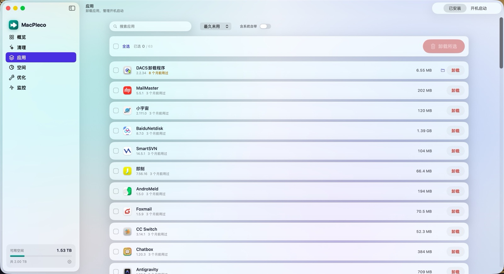

<div align="center">
  <h1>MacPleco</h1>
  <p><strong>一款安静、原生、遵循液态玻璃设计的 Mac 清理工具。</strong></p>
  <p>
    <a href="README.md">English</a> ·
    <a href="README.zh-CN.md"><strong>简体中文</strong></a>
  </p>
  <p>
    <a href="https://github.com/decli/MacPleco/releases/latest"></a>
    
    
    <a href="LICENSE"></a>
  </p>
  
</div>

---

清道夫鱼安安静静地把鱼缸打理干净。MacPleco 对 Mac 做同样的事，而且是为
**不想搞懂 `~/Library/Caches` 是什么**的人做的。

## 为什么再做一个

大部分 Mac 清理工具靠制造焦虑吸引注意：满屏飘红、给你数“问题”、把最危险的按钮
做得最显眼。MacPleco 反着来。

| 原则 | 具体含义 |
|---|---|
| **默认可撤销** | 所有内容先进废纸篓。选错了只需去废纸篓“放回原处”，不用翻备份。“跳过废纸篓”是单独的开关，每次执行后自动复位。 |
| **说人话，也给准确路径** | 列表写“Chrome 浏览器缓存”，不只扔给你 `~/Library/Caches/com.google.Chrome`；同时在选择前展示绝对路径和访达按钮。 |
| **危险项默认不选** | 聊天软件缓存可能包含无法重新下载的图片和视频，所以 MacPleco 不会替你勾选。Xcode 归档、Maven 仓库、模型权重和正被应用占用的数据同理。 |
| **数字不注水** | 磁盘体积使用十进制，与访达一致。没找到可清理内容会被当作好消息；系统不支持的指标会明确显示不可用，不用估算值冒充。 |
| **不要管理员密码** | 清理只在当前账户内进行。为了少量系统空间去索要高权限或调用私有接口，不值得。 |

## 功能

**概览** — 一屏看完磁盘多满、能回收多少，再给出一个主要按钮。不懂技术的人看到
这里就可以停下，也不会做错。

**清理** — 覆盖缓存、日志、浏览器数据、开发构建产物、AI 工具缓存、云盘缓存、窗口
状态、卸载残留、旧安装包和废纸篓。正在占用缓存的应用会单独列出，并显示退出后可释放
的空间。每一项都有完整路径，也能通过行内按钮或右键菜单在访达中定位，确认后再选择。


**应用** — 展示所有已安装应用、体积和上次打开时间，每行都有常驻的卸载按钮。卸载前先
列出完整计划：应用本体，以及散落在各处的偏好设置、沙盒容器和缓存；每项都有体积，也可以
单独保留。勾选多个应用后批量卸载同样如此：一张清单列出每个应用和每一处残留，确认前任意
一项都可以取消。开机启动项也包含在内，可按名称、范围或“开机即启动”排序。



**空间** — 全宽矩阵树图使用清晰的自适应字号，悬停时与 Top 12 排名卡片联动，并提供
面包屑导航；大量小项目会诚实合并为“其他”，不再挤成无法点击的碎片。单击即可逐层深入。
大文件页列出常用文件夹中超过 100 MB 的文件，显示绝对路径、常驻访达按钮、复制路径和
可撤销的“移到废纸篓”操作。文件夹体积改用 `getattrlistbulk` 配合工作窃取线程池测量，
整台机器一起攻克最大的那个文件夹，而不是丢给单线程：417 GB 的个人文件夹从 17.9 秒降到
3.1 秒，总量完全一致。


**优化** — 针对八种具体毛病的小修复：“打开方式”菜单错乱、预览图空白、字体显示成
方块、DNS 过期、图标变白纸、共享盘里的 `.DS_Store`、窗口跑到屏幕外、访达卡死。
每一项都有常驻的“执行”按钮，也可以勾选多项一起执行。默认一个都不选。


**监控** — 四张等高卡片展示实时状态：CPU 区分应用与系统，内存区分应用、系统占用与
压缩，GPU 显示整块显卡负载，网络区分下载与上传。每项都是两三个不同的量，因此各自使用
独立颜色并配有图例，不再混成一根看不出成分的线。进程表可按名称、路径或 PID 搜索，可只看
应用或只看系统进程，并能按名称、内存、启动时间或 CPU 正反序排列。任意一行都可以在访达中
定位，或要求它退出——先好好商量，你坚持时才强制结束。macOS 没有向普通 App 公开“每个进程
的 GPU 占用”，因此 GPU 按整机报告，而不是逐行编造。离开页面后自动停止采样。


**菜单栏** — 菜单栏小鱼随时回答“磁盘还剩多少”，同时展示实时状态并一键进入清理。

## 安装

从 [Releases](https://github.com/decli/MacPleco/releases/latest) 下载 `.dmg`，
把 MacPleco 拖进“应用程序”。

本项目开源，没有购买 Apple 开发者证书，因此 macOS 会提示“无法验证开发者”。打开
**系统设置 → 隐私与安全性**，滑到底部点“仍要打开”；或者在终端执行一次：

```bash
xattr -dr com.apple.quarantine /Applications/MacPleco.app
```

然后按应用内引导授予**完全磁盘访问权限**。macOS 默认不允许 App 读取其他 App 的
缓存目录，没有这项权限，MacPleco 无法准确测量它们。

需要 **macOS 15 或更高版本**。macOS 26 会通过 Apple 的系统 API 渲染液态玻璃；
更早的系统自动回退到系统材质。

## 安全设计

删除有两道独立闸门：规则目录不会提供某些路径，真正执行时 `SafePath` 会再拒绝一次。
因此规则写错不会直接变成磁盘上的错误。

三种删除策略的权限范围彼此独立：

| 策略 | 范围 |
|---|---|
| `sweep` | 自动清理。只允许当前个人文件夹内一小组明确的缓存和日志根目录。 |
| `uninstall` | 在上一项基础上只增加 `/Applications` 中的应用包。 |
| `userSelected` | 你在空间地图或大文件列表中亲自选择的路径。 |

模型权重文件（`.gguf`、`.safetensors`、`models/` 目录下的内容、Ollama 的 blob
存储）在任何情况下都不会被自动清理。它们体积大、重新下载慢，不该被当成垃圾。

完整策略请看 [`SafePath.swift`](Sources/MacPlecoKit/Core/SafePath.swift) 及其
[测试](Tests/MacPlecoKitTests/SafePathTests.swift)。

## 自己编译

没有 Xcode 工程文件，也没有第三方依赖。

```bash
git clone https://github.com/decli/MacPleco.git
cd MacPleco
swift test                          # 运行安全测试
./scripts/build-app.sh 1.0.0        # -> dist/MacPleco.app（通用架构）
./scripts/make-dmg.sh 1.0.0         # -> dist/MacPleco-1.0.0.dmg
```

应用图标由 `scripts/make-icon.py` 生成，只使用 Python 标准库。

## 致谢

MacPleco 是完全重写的原生应用，但建立在 [tw93](https://github.com/tw93) 的
[**Mole**](https://github.com/tw93/Mole) 所积累的领域知识之上。Mole 是非常优秀的
命令行 Mac 维护工具；如果你习惯用终端，请直接使用它。

## 许可

[GPL-3.0](LICENSE)，与 Mole 相同。
